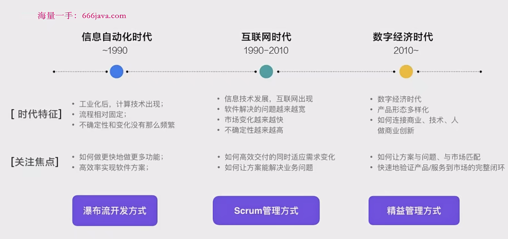

## 什么是用户需求
用户说的≠用户实际做的≠用户心里想的

需求变化越来越快，有效期越来越短  

**需求的本质是：多个干系人想要达成的业务目标，与现状之间的差距**

#### 需求的特点：
###### 需求是隐性的，需要有价值的洞察  
需求往往不显而易见，用户可能无法直接表达或意识到其真实需求，产品经理需要通过深入洞察挖掘这些需求。  
如“冰山模型”所示，产品经理需要通过深入了解用户行为和心理，挖掘深层次需求。例如，今日头条不仅满足用户浏览新闻的需求，还进一步满足了用户定制内容、推荐算法等更深层次的需求。
###### 获取需求价值需要社会化协作 
需求的形成和实现需要多方干系人的共同参与，包括客户、用户、开发团队等。 
需求的形成和传递是一个多角色协作的过程，需要产品经理确保需求在传递过程中不变形、不过度解读。
###### 需求是多方干系人诉求的综合结果  
产品需求通常由多个干系人的诉求综合而成，产品经理需要在满足多方需求的基础上做出合理的平衡。例如“饿了么”的到店取货功能，既满足了用户的需求，也兼顾了外部合作伙伴和内部决策者的诉求。
>饿了么  
大众用户：为了节省外卖费近距离外卖希望可以到店取货  
分析数据：80%用户选择送餐1公里且30分钟之内可以配送的店铺点餐  
外部合作用户：门店希望已经到店的用户也可以通过饿了么点餐  
内部决策者：为了获得加入饿了吗平台更多的商户数，需要推出该功能  
内部使用者：运营人员将该增值功能作为优秀外卖门店的奖励  
###### 需求是一组动态的待验证的假设  

<a src = "https://thenatureofbusiness.org/2012/06/18/change-is-inevitable/">Change is Inevitable</a>

需求是动态变化的，在产品设计和开发过程中，需求是一个有待验证的假设，需要持续关注市场反馈。  
市场反馈可能促使产品功能调整或淘汰，如亚马逊的Dash按钮的生命周期。

#### 到底要关注谁的需求？

###### 用户需求 vs. 客户需求
用户和客户的区别：  
用户：直接使用产品的人，关注使用效果。  
客户：购买产品的人，关注产品的性价比和效果。  
**以用户为中心的设计原则**：优先考虑**用户需求**，再进行客户需求的平衡。例如，产品功能的设计优先满足用户的使用体验，而后再考虑成本和技术实现。

以用户为中心的设计原则
- 人性需求的反映：产品设计应考虑到用户的深层心理需求，如安全感、秩序感、吸引力等，这些需求往往是用户行为的驱动力。
- 用户需求的15种深层心理：包括吸引力、领导力、自我感觉良好等，产品应通过功能设计去满足这些深层次心理需求。
- 案例分析：如滴滴出行和儿童早教机的例子，分别解释了用户和客户的关系及其需求。

>需求的本质体现的是人性 ———— Y模型-苏杰《人人都是产品经理》

| 用户深层心理和情感诉求 | 满足方式                  |
| ---------------------- | ------------------------- |
| 吸引力                 | 直播                      |
| 归属感                 |                            |
| 掌控欲驱动感           | 游戏                      |
| 自由自在               | 游戏                      |
| 乐趣与兴奋             | 游戏                      |
| 和谐                   | 游戏                      |
| 表现自我               | 微博 / 博客 / QQ空间       |
| 拥有智慧和知识         | 知乎                      |
| 成为领导者             | 直播                      |
| 爱和被爱               |                            |
| 尊重                   |                            |
| 安全                   | 支付宝                    |
| 自我放纵               | 抖音                      |
| 传统                   |                            |
| 自我感觉良好           | 直播                      |

###### 特殊情况：以客户为中心的设计
遗留系统：老旧系统满足的是当时的客户需求，用户体验可能不佳。  
内部系统：为了满足特殊行业或公司内部的标准和安全要求，设计可能复杂且用户不友好。  
B2B系统：主要满足客户的商业目标，用户体验可能次之。  

## 需求响应的发展历史
**三种需求响应方式：**
- 预测型（瀑布流式开发）：传统的、线性的软件开发方式，适合需求明确且开发周期较长的项目。
- 经验型（Scrum敏捷开发）：迭代周期短，适合需求逐步明确且需要快速响应市场变化的项目。
- 精益创业型：不断循环迭代，通过市场反馈快速调整，适合高度不确定性和创新型的项目。
#### 瀑布流
1.一次性准备好全部文档内容
2.关键节点少
3.开发周期长
4.团队规模大
5.中途会出现方案修改，影响进度
6.团队分工明确，分别负责不同模块儿开发，交流不频繁  
#### Scrum敏捷开发
1.关键节点变多
2.轻量文档
3.团队规模变小
4.方案及时修改  

#### 精益创业
1.以可工作的软件产品为最终目标
2.快速迭代
3.快速发布
4.快速验证
**方式的适用性：**

瀑布流式开发：适合目标明确、需求清晰、时间周期较短的项目。  
Scrum敏捷开发：适合大方向明确，但需要频繁调整和迭代的小型功能模块。  
精益创业型：适合创新项目或实验性质的产品，快速试错和调整产品策略。  

## 为什么要挖掘用户需求
#### 用户需求的复杂性：用户往往无法明确表达其真实需求，需求变化快且多样。产品经理需要通过沟通、认知和对人性的理解，挖掘出用户的真实需求。
#### 表面需求 vs. 深层需求：
表面需求：用户显而易见的需求，如“我要一匹跑得更快的马”。
深层需求：用户背后的真实动机，如“我需要更快到达目的地”。

>海底捞的等位体验--娱乐、美甲、小食  
用户痛点:等位时间太长需求是缩短等位时间吗？需求是不要把等位的时间白白浪费掉

#### 隐性需求 vs. 显性需求：
显性需求：用户可以明确表达的需求，如“我需要一副眼镜”。
隐性需求：用户无法直接表达，但在满足后会感到惊喜的需求，如“隐形眼镜”。

当用户的显性需求被满足时，用户一般不会兴奋或惊喜，而不被满足时，用户则会产生抱怨。  
用户的隐性需求被满足时，用户一般会兴奋或惊喜而不被满足时，用户却不会产生抱怨。  

>穷游  
显性:旅游相关机酒预定，攻略查询
隐性:有限的预算下，可以有高品质的旅游体验

>小红书  
显性:购买化妆品等
隐性: 学习和分享产品

#### a真需求 vs. 伪需求：
真需求：通过多个维度（如时效性、频率、背景、成本等）验证的真实需求。
伪需求：未能通过验证，或者需求的实现成本与收益不成正比的需求。

##### 真需求的定义和特征
**定义**：真需求是指那些经过深思熟虑、多维度分析后，确实存在并且具备一定普遍性和紧迫性，值得开发资源投入的需求。它们通常与用户的核心问题或痛点直接相关，能够带来显著的用户价值和商业价值。

**特征**：
  - **高频率和广泛性**：真需求通常是用户在日常使用中经常遇到的问题，具有一定的普遍性。例如，用户频繁表达对某个功能的需求或在某种场景下经常遇到的痛点。
  - **强烈的使用意愿**：用户有强烈的意愿使用该功能或产品，并且在被满足后，用户体验会显著提升。
  - **经济可行性**：实现这个需求的成本与预期收益之间有合理的平衡。即使需要投入较大的资源，预期的回报（如用户增长、提高满意度、增加收入）也是值得的。
  - **一致性和持续性**：该需求在用户群体中具有一致性，且不会随着时间的推移或环境的变化而迅速消失。

##### 伪需求的定义和特征
**定义**：伪需求是指那些看似存在，但经过深入分析后，发现并不具备实际价值或开发必要性的需求。伪需求往往是基于误解、暂时的偏好或小部分用户的独特需求提出来的，不具备普遍性和可持续性。

**特征**：
  - **低频率和小众性**：伪需求通常只是部分用户在某些特定场景下的需求，频率较低，普遍性不强。大多数用户可能根本不在意这个功能。
  - **低使用意愿**：即使这个需求被满足，用户的使用意愿也可能不强，或者这个功能最终被忽略，使用率很低。
  - **成本与收益不匹配**：实现这个需求的开发成本过高，而预期的收益（如用户增长、满意度提升）却不明显，甚至没有收益。
  - **短暂性和不一致性**：伪需求可能是基于一时的趋势或用户的暂时性偏好，随着时间的推移，它可能很快失去价值。

##### 真需求与伪需求的判断标准
**结构化信息分析**：
  - **时效性**：需求发生的频率是关键因素。高频需求往往更接近真需求，低频需求则需要进一步验证。
  - **用户广泛性**：分析这个需求是否涉及大多数用户。一个真需求通常会在较大用户群体中出现，而伪需求可能只是小部分用户的需求。
  - **实现成本与收益评估**：考虑实现该需求的成本是否与预期收益匹配。如果成本过高且收益不明显，这很可能是一个伪需求。
  - **需求背景与场景**：分析需求产生的背景和场景是否具有普遍性，是否能在不同的环境下重现。如果该需求只在特定情况下出现，可能是伪需求。

>**电商平台的支付系统优化**：用户普遍反映支付过程复杂，希望支付方式多样化且流程简化。这种需求具有高频率、高广泛性，而且支付系统的优化直接影响转化率，是典型的**真需求**。

>**在线教育平台的虚拟背景功能**：假设有一部分用户建议在视频课程中加入虚拟背景功能，但经过调研发现，这只是小部分用户的需求，而且在大部分教育场景中并不必要。实现这个功能的开发成本较高，且预期的使用率和收益都不高，因此可以判定为**伪需求**。

##### 真需求与伪需求的应用与决策
**决策依据**：产品经理在面对需求时，应结合市场调研、用户反馈、数据分析等手段，对需求进行全方位评估。只有那些符合真需求标准的，才应该投入资源开发。伪需求则应慎重考虑，避免浪费开发资源。

**动态验证**：即便被认为是真需求，也需要通过产品上线后的数据和用户反馈进行动态验证，确保该需求确实对用户和业务产生了正面影响。